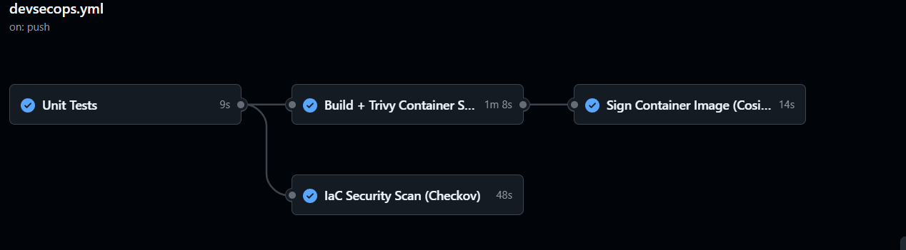
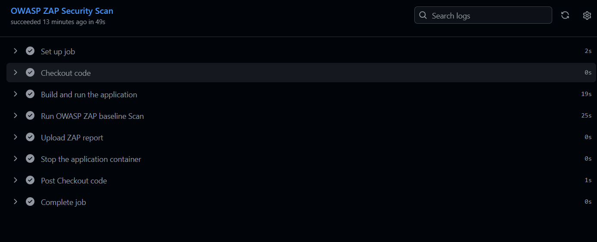
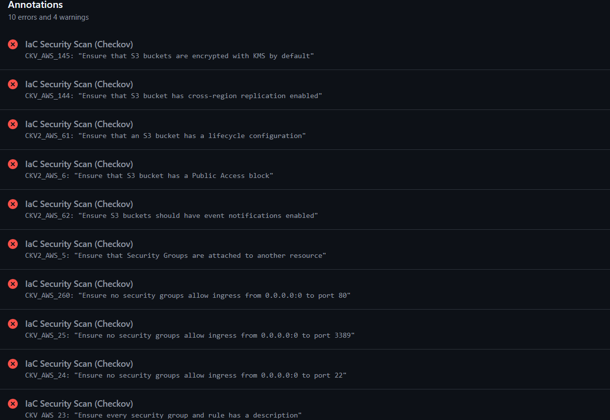
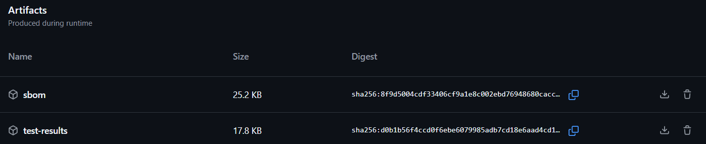
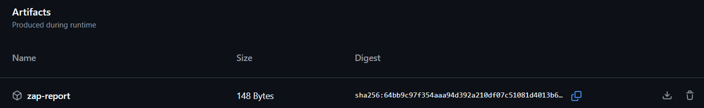
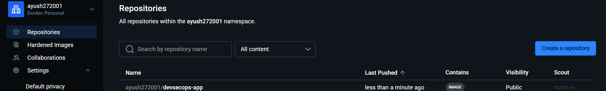

<div align="center">

# DevSecOps Pipeline

**A security-first CI/CD pipeline where every deployment passes through automated security gates.**
Critical vulnerabilities, IaC misconfigurations, and web vulnerabilities block the pipeline entirely — nothing insecure gets deployed.

</div>

---

## What is this?

I built this to understand how security is integrated into a CI/CD pipeline in practice — not bolted on at the end, but enforced at every stage automatically.

The idea: security is not optional. A critical CVE in the container image, an open security group in Terraform, or a missing security header in the live app — any of these fails the pipeline and blocks deployment. No exceptions.

---

## How it works

```
Developer pushes code
        ↓
Unit Tests pass
        ↓
┌─────────────────────────────────────────┐
│            Security Gates               │
│                                         │
│  Checkov   → IaC misconfiguration scan  │
│  Trivy     → Container CVE scan         │
│  OWASP ZAP → Live app DAST scan         │
│  Cosign    → Cryptographic image sign   │
│  SBOM      → Software bill of materials │
└─────────────────────────────────────────┘
        ↓
All gates pass → Image signed → Safe to deploy
        ↓
Any gate fails → Pipeline blocked → Nothing deploys
```

---

## Stack

<table>
  <tr>
    <th>Tool</th>
    <th>Purpose</th>
    <th>Blocks pipeline?</th>
  </tr>
  <tr>
    <td>Trivy</td>
    <td>Scans Docker image for known CVEs</td>
    <td>Yes — on CRITICAL severity</td>
  </tr>
  <tr>
    <td>Checkov</td>
    <td>Scans Terraform and Dockerfile for misconfigurations</td>
    <td>Configurable (soft_fail)</td>
  </tr>
  <tr>
    <td>OWASP ZAP</td>
    <td>Runs dynamic scan against the live running app</td>
    <td>Yes — on high severity findings</td>
  </tr>
  <tr>
    <td>Cosign</td>
    <td>Cryptographically signs the container image</td>
    <td>Yes — unsigned images rejected</td>
  </tr>
  <tr>
    <td>SBOM (CycloneDX)</td>
    <td>Generates software bill of materials for every release</td>
    <td>No — audit and compliance</td>
  </tr>
  <tr>
    <td>GitHub Security tab</td>
    <td>Displays Trivy SARIF findings inline in the repo</td>
    <td>No — visibility only</td>
  </tr>
  <tr>
    <td>Node.js + Express</td>
    <td>The application being secured</td>
    <td>—</td>
  </tr>
  <tr>
    <td>GitHub Actions</td>
    <td>Orchestrates the full pipeline</td>
    <td>—</td>
  </tr>
</table>

---

## Project Structure

```
devsecops-pipeline/
├── src/
│   └── app.js                      # Express app — health, users, echo endpoints
├── tests/
│   └── app.test.js                 # Jest test suite
├── terraform/
│   └── main.tf                     # Terraform with intentional misconfigs for Checkov
├── .zap/
│   └── rules.tsv                   # ZAP false positive suppressions
├── .github/
│   └── workflows/
│       ├── devsecops.yml           # Main pipeline — tests, Checkov, Trivy, Cosign, SBOM
│       └── zap-scan.yml            # OWASP ZAP dynamic scan workflow
├── Dockerfile                      # Security hardened — non-root, dumb-init, healthcheck
├── package.json
└── .gitignore
```

---

## Pipeline Jobs

**`devsecops.yml`** — four jobs that run in order:

<table>
  <tr>
    <th>Job</th>
    <th>What it does</th>
    <th>Runs on</th>
  </tr>
  <tr>
    <td>Unit Tests</td>
    <td>Runs Jest test suite with coverage report</td>
    <td>Every push and PR</td>
  </tr>
  <tr>
    <td>Checkov Scan</td>
    <td>Scans Terraform and Dockerfile for security misconfigurations</td>
    <td>Every push and PR</td>
  </tr>
  <tr>
    <td>Build + Trivy Scan</td>
    <td>Builds Docker image, scans for CVEs, generates SBOM, pushes to DockerHub</td>
    <td>Every push and PR</td>
  </tr>
  <tr>
    <td>Sign Image</td>
    <td>Cosign signs the image using GitHub OIDC and verifies the signature</td>
    <td>Merge to main only</td>
  </tr>
</table>

---


--- 

**`zap-scan.yml`** — runs separately:

Starts the app in Docker, runs OWASP ZAP baseline scan against all live endpoints, uploads full HTML report as a GitHub Actions artifact.

---


---

## Security Hardened Dockerfile

```dockerfile
FROM node:20-alpine          # Minimal base image — fewer packages, fewer CVEs
RUN apk add dumb-init        # Proper signal handling — no zombie processes
RUN npm ci --only=production # Exact versions, no dev dependencies in production
RUN adduser nodeuser         # Non-root user created
USER nodeuser                # App never runs as root
HEALTHCHECK ...              # Container self-reports its own health status
ENTRYPOINT ["dumb-init"]     # Proper process management
```
---
### Error Detected by Checkov


---

## Artifacts Generated

Every pipeline run produces four downloadable artifacts — found under **Actions** → completed run → bottom of the page.

<table>
  <tr>
    <th>Artifact</th>
    <th>Format</th>
    <th>What it contains</th>
  </tr>
  <tr>
    <td>coverage</td>
    <td>HTML</td>
    <td>Jest test coverage — which lines are tested and which are not</td>
  </tr>
  <tr>
    <td>trivy-results</td>
    <td>SARIF</td>
    <td>CVE findings — displayed automatically in GitHub Security tab</td>
  </tr>
  <tr>
    <td>sbom</td>
    <td>CycloneDX JSON</td>
    <td>Every package, version, and license inside the container image</td>
  </tr>
  <tr>
    <td>zap-report</td>
    <td>HTML</td>
    <td>Full OWASP ZAP results — every endpoint tested with findings</td>
  </tr>
</table>

---


#### Zap Scan Artifact


---

## Running Locally

**Prerequisites:** Node.js 20+, Docker

```bash
# Clone the repo
git clone https://github.com/ayush272001/devsecops-pipeline.git
cd devsecops-pipeline

# Install and test
npm install
npm test

# Build and run with Docker
docker build -t devsecops-app .
docker run -p 3000:3000 devsecops-app
```

Visit `http://localhost:3000/health`:

```json
{ "status": "ok", "timestamp": "..." }
```

---
### Image Upload onto DockerHub


---

## API Endpoints

| Method | Route | Description |
|--------|-------|-------------|
| `GET` | `/health` | Health check — returns status and timestamp |
| `GET` | `/api/users` | Returns list of users |
| `POST` | `/api/echo` | Echoes back whatever JSON body you send |

---

## GitHub Secrets Required

<table>
  <tr>
    <th>Secret</th>
    <th>Purpose</th>
  </tr>
  <tr>
    <td><code>DOCKERHUB_USERNAME</code></td>
    <td>DockerHub username — used to push the signed image</td>
  </tr>
  <tr>
    <td><code>DOCKERHUB_TOKEN</code></td>
    <td>DockerHub access token — generated in DockerHub account settings</td>
  </tr>
</table>

> Cosign uses GitHub's OIDC token for signing — no additional secret needed.

---

## What I learned building this

The most valuable insight was understanding the difference between SAST and DAST. Trivy and Checkov are static — they scan files without running anything. OWASP ZAP is dynamic — it actually starts the app and attacks it. A static scan cannot find runtime vulnerabilities like missing security headers or endpoints that behave differently under malicious input. You need both.

The other thing that changed how I think about pipelines was Cosign. Signing the image with GitHub's OIDC identity means you can cryptographically prove that a specific image was built by a specific GitHub Actions run from a specific commit. If someone tampers with the image after it is pushed to DockerHub, the signature verification fails. That is supply chain security in practice.
